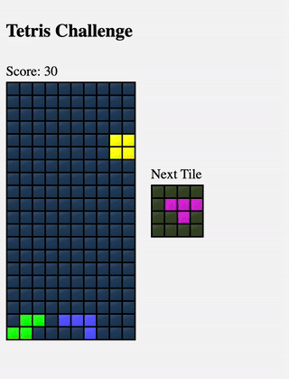

# Tetris Implementation

This project is a technical challenge originally created for a Swedish technology company.

A modern implementation of the classic Tetris game following standard game rules and mechanics.

## Game Overview

The game is played on a 10x20 grid board (10 columns, 20 rows) where pieces fall from the top. Each cell can be either empty or filled.

### Game Features

- 7 classic Tetris pieces (O, I, S, Z, L, J, T)
- 10 difficulty levels
- Score system based on actions and level
- Color-coded pieces
- Standard Tetris controls

### Game Mechanics

#### Pieces
- Each piece has a unique shape and color
- Pieces spawn at the top center of the board
- Pieces can rotate counterclockwise
- Different pieces have different numbers of rotation states:
  - O piece: 1 orientation
  - I, S, Z pieces: 2 orientations
  - L, J, T pieces: 4 orientations

#### Controls
- Left/Right: Move piece horizontally
- Rotate: Turn piece counterclockwise
- Drop: Instantly drop piece to bottom

#### Gameplay
- Pieces fall automatically based on current level
- Completing rows removes them and awards points
- Up to 4 rows can be completed simultaneously
- Game speed increases with level

#### Levels and Speed
- 10 difficulty levels (1-10)
- Fall speed increases with each level
- Level 1: 0.50 seconds per step
- Level 10: 0.05 seconds per step

#### Scoring System
Points are awarded for:
- Landing pieces
- Quick drops
- Completing lines
- Multiple line completions give bonus points
- Higher levels award more points

## Technical Requirements

Please check package.json for dependencies and setup instructions.

## Getting Started

1. Install dependencies
2. Run the game
3. Use arrow keys or defined controls to play

## Game Rules

1. Pieces fall from the top of the board
2. Player can move and rotate pieces as they fall
3. Completing a row removes it and awards points
4. Game ends if pieces stack to the top
5. Higher levels mean faster falling pieces
